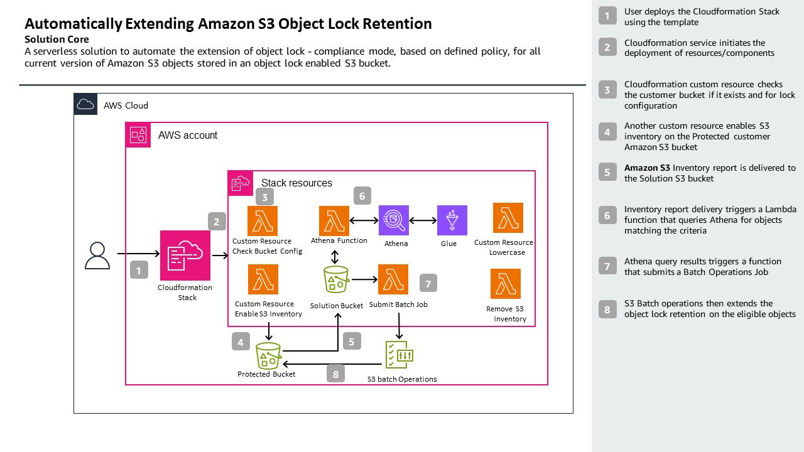
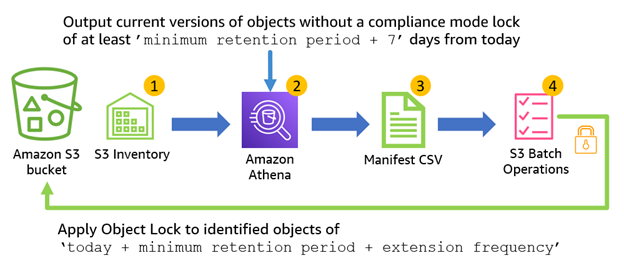
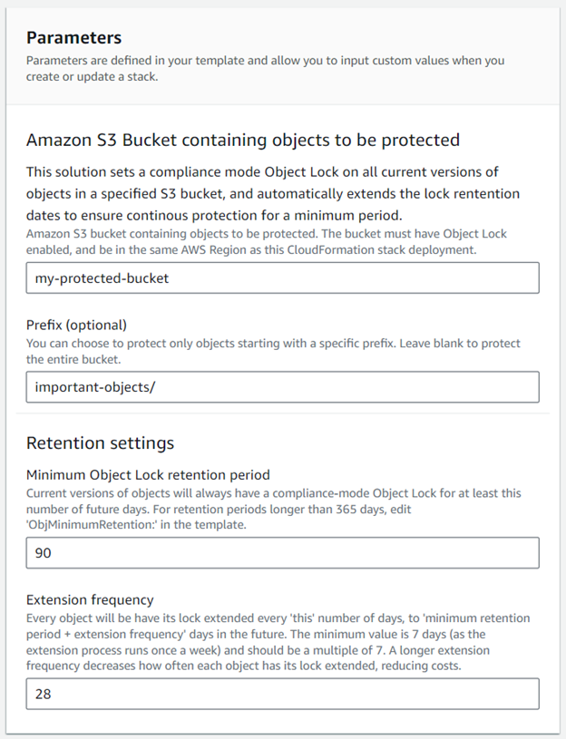

# Maintaining object immutability by automatically extending Amazon S3 Object Lock retention

##  

## Description

[Amazon S3 Object Lock](https://aws.amazon.com/s3/features/object-lock/) is the industry standard for object storage immutability for ransomware protection, and enterprises around the world use it to keep their data safe. When an object is locked in compliance mode, users can’t change the retention mode or shorten the retention period. [Compliance mode](https://d1.awsstatic.com/r2018/b/S3-Object-Lock/Amazon-S3-Compliance-Assessment.pdf) helps make sure that users can’t overwrite or delete an object version for the duration of the retention period

Here, we present a solution that automatically extends Object Lock retention dates, at scale. By continually extending the retention of all current versions of objects stored in an [Amazon Simple Storage Service (Amazon S3) bucket](https://aws.amazon.com/s3/), objects cannot be permanently deleted until they become noncurrent and a defined minimum retention period has passed.
 

## Customer Value

Protecting against accidental or malicious deletion is a key element of data security. Immutability protects data in-place, preventing unintended changes or deletions. However, sometimes it isn’t clear for how long data should be made immutable. Users in this situation are looking for a solution that maintains short-term immutability, indefinitely. They want to make sure their data is always protected, without any long-term commitment. 

The solution is fully automated, and deploys using an [AWS CloudFormation](https://aws.amazon.com/cloudformation/) template. It automates and orchestrates the tasks associated with querying and extending the object lock retention date of objects in the protected Amazon S3 bucket. 
 

## Architecture, Components and Workflow

 
**_Components and Flow:_**
 

**_Workflow:_**

 
**AWS Services used:**

[AWS CloudFormation](https://aws.amazon.com/cloudformation/)

[Amazon Simple Storage Service (S3)](https://aws.amazon.com/s3/)

[AWS Lambda](https://aws.amazon.com/lambda/)

[AWS Glue](https://aws.amazon.com/glue/)

[Amazon Athena](https://aws.amazon.com/athena/)

[AWS Identity and Access Management (IAM)](https://aws.amazon.com/iam/)
 
 
### Prerequisites

The instructions in this post assume that you have required AWS Account [IAM permissions](https://docs.aws.amazon.com/IAM/latest/UserGuide/access_policies.html) in addition to basic knowledge of [AWS Cloudformation](https://aws.amazon.com/cloudformation/). You also need to have the following resources:
 

* An existing Amazon S3 Bucket (general purpose) containing the objects to be protected with versioning and object lock enabled.

### Summary of the steps

* [Deploy](https://docs.aws.amazon.com/AWSCloudFormation/latest/UserGuide/GettingStarted.Walkthrough.html) the AWS CloudFormation template 

* Specify the required parameters for the Stack, these include, the name of your Amazon S3 bucket containing objects to be protected, optional prefix, your desired minimum retention period and desired extension frequency. 

* Monitor the Object Lock Retention jobs via Amazon S3 Batch Operations Management Console

* Finally, you can also check the retention dates of the objects via the Amazon S3 Management Console, using S3 Inventory.

### Deployment

** **** **
Listed below are the Cloudformation Stack parameters included in the template.
** **** **

|  Name                               | Description |
|:--------------------------------- |:------------ |
|  Stack name                         | Any valid alphanumeric characters and hyphen |
|  Amazon S3 Bucket containing objects to be protected  | The Amazon S3 Bucket you want to protect its contents. |
|  Prefix (optional)  | You can choose to protect only objects starting with a specific prefix. Leave blank to protect the entire bucket. |
|  Minimum Object Lock retention period  | Current versions of objects will always have a compliance-mode Object Lock for at least this number of future days. For retention periods longer than 365 days, edit 'ObjMinimumRetention:' in the template. |
|  Extension frequency  | Every object will be have its lock extended every 'this' number of days, to 'minimum retention period + extension frequency' days in the future. The minimum value is 7 days (as the extension process runs once a week) and should be a multiple of 7. A longer extension frequency decreases how often each object has its lock extended, reducing costs. |
 
_Steps to deploy:_
 

* Download the solution template “auto-extend-obj-lock-latest.yaml” in the code section above
* Login to [AWS Management Console](https://console.aws.amazon.com/console/home) in the region where your Amazon S3 Bucket is created and navigate to the AWS CloudFormation console.
* Choose Create Stack (with new resources). At the Prerequisite section, accept the default option Template is ready.
* At the Specify Template section, select Upload a template file, choose file and then use the previously downloaded CloudFormation template. After selecting, choose Next.
* You need to specify the Stack name, your Amazon S3 Bucket name, optionally specify a Prefix, and your Retention Settings namely your desired minimum retention period and desired extension frequency, the predefined values for the retention settings are set to **30** and **7** respectively.
* At the **Configure stack options** page, choose **Next** to proceed. At the next page, scroll down to accept the acknowledgement and **Create Stack**.
* Cloudformation will automatically deploy the solutions components and perform some initial checks and actions.

 
_Cloudformation Console Screenshots:_
 

 

#### Monitoring the solution

The status of the S3 Batch Operations Jobs triggered by the solution can be found in the [Amazon S3 Batch Operations console](https://s3.console.aws.amazon.com/s3/jobs). 

You can filter the Job description as it includes the protected bucket name. In addition, the jobs are tagged so that they can be easily identified:
	Key: job-created-by
	Value: Auto Extend Object Lock Solution
 
S3 Inventory reports, Athena outputs, and S3 Batch Operations reports are stored in the solution bucket. These are your records of compliance with your defined minimum retention period. 

 
## Guidance and Troubleshooting

The solution is dependent on the availability and performance of multiple underlying AWS services including S3, Glue, Athena, Lambda and IAM services. 

During deployment, the stack uses an AWS Lambda function to check that the protected bucket has Object Lock enabled. If it does not, then deployment fails. 

The stack deploys in around five minutes, and it operates automatically as soon as the first [S3 Inventory](https://docs.aws.amazon.com/AmazonS3/latest/userguide/storage-inventory.html) is delivered. It might take up to [48 hours](https://docs.aws.amazon.com/AmazonS3/latest/userguide/configure-inventory.html) to deliver the first Inventory. This solution does not use any existing S3 Inventory configurations, as it needs a specific output format and location. It is in addition to, and does not interfere with, any other S3 Inventory configurations.

As it runs weekly, this solution does not apply immediately to newly-created objects. If this is a requirement, then configure the bucket’s [default Object Lock retention settings](https://docs.aws.amazon.com/AmazonS3/latest/userguide/object-lock-overview.html#object-lock-bucket-config) to compliance mode with a duration of at least a week. Then, this solution extends this lock on each object in scope, making sure the objects are always protected. Be aware that alternative Object Lock retention settings may be applied to new objects as they are written, unless denied by a [bucket policy](https://docs.aws.amazon.com/AmazonS3/latest/userguide/object-lock-managing.html#object-lock-managing-retention-limits) as in this [example](https://catalog.workshops.aws/s3-data-protection/en-US/20-module-2/29-bucket-policy-deny-lock-override).
 

In testing, we found that extending all 1 billion current version objects in a prefix completed remarkably quickly:
Athena processing inventory (and outputting a 66 GB .csv file!): 14 minutes.
S3 Batch Operations:
o	Preparing [phase](https://docs.aws.amazon.com/AmazonS3/latest/userguide/batch-ops-job-status.html): Approximately eight hours.
o	Active phase (applying Object Locks): Approximately 24 hours.

This shows that the solution scales to even the largest S3 buckets. Note that as the default [Athena DML query](https://docs.aws.amazon.com/athena/latest/ug/service-limits.html) timeout is 30 minutes, if your bucket has more than around 2 billion objects, then you may need to take one or both of the following actions:
1.	Request an increased DML query timeout in [Athena service quotas](https://console.aws.amazon.com/servicequotas/home?region=us-east-1#!/services/athena/quotas).
2.	Deploy the CloudFormation template multiple times, specifying different prefixes.

## Costs

PUT operations for Object Lock extensions are charged as an [S3 Standard storage class PUT request](https://aws.amazon.com/s3/pricing/), regardless of the storage class the object is in. The only other notable charges for the solution come from S3 Batch Operations.

## Cleaning up
 
As the solution is deployed using CloudFormation, you can remove it by deleting the CloudFormation stack. Deleting the CloudFormation stack does not affect the Object Lock retention period applied to any objects.

You must delete the ‘solution’ S3 bucket (created to store inventories, Athena output and reports) manually. To identify the solution bucket, go to the CloudFormation console, select the stack, choose Resources, locate ExtendObjLockInventoryBucket, and select the link to open a new tab displaying the solution bucket. To empty the bucket, you can apply a lifecycle rule or use the Empty bucket button in the S3 console. Once the S3 bucket is empty, proceed to delete it.

 

### Additional resources

* [AWS CloudFormation product page](https://aws.amazon.com/cloudformation/)
* [S3 Batch Operations documentation](https://docs.aws.amazon.com/AmazonS3/latest/userguide/batch-ops.html)
* [AWS Lambda product page](https://aws.amazon.com/lambda/)
* [Amazon S3 pricing page](https://aws.amazon.com/s3/pricing/)
* [AWS Lambda pricing page](https://aws.amazon.com/lambda/pricing/)
* [Amazon S3 Performance Guidelines](https://docs.aws.amazon.com/AmazonS3/latest/userguide/optimizing-performance.html)
* [AWS Lambda Performance Guidelines](https://docs.aws.amazon.com/lambda/latest/operatorguide/perf-optimize.html)
* [Serverless Data Integration – AWS Glue – Amazon Web Services](https://aws.amazon.com/glue/)
* [Interactive SQL - Serverless Query Service - Amazon Athena - AWS](https://aws.amazon.com/athena/)

## Security

See [CONTRIBUTING](CONTRIBUTING.md#security-issue-notifications) for more information.

## License

This library is licensed under the MIT-0 License. See the LICENSE file.
